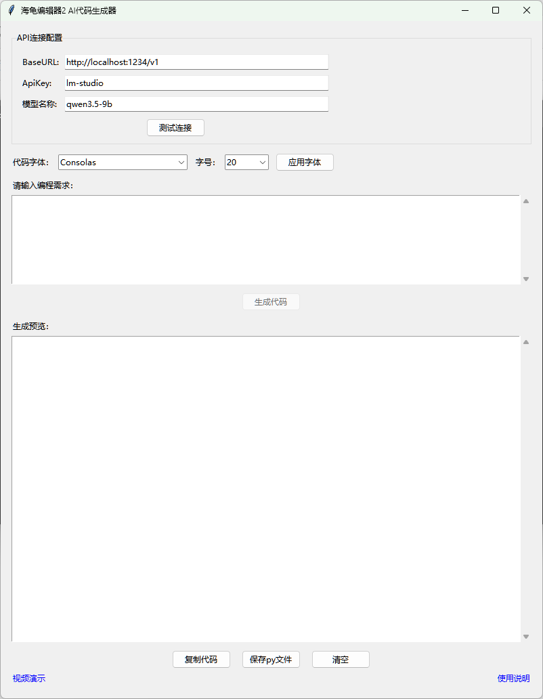

# 海龟编辑器2 ai代码生成器 / Turtle Editor2 ai code generator
[English](#english) | [中文](#chinese)

---

### 项目简介
用于海龟编辑器2通过LM Studio、Ollama等模型辅助软件连接本地模型或云端模型生成代码。本项目界面、代码由豆包（字节跳动 Seed 大模型）辅助生成，由开发者手动调试、整合、优化并开源发布。

### 使用方法
1. 安装[Python](https://www.python.org/downloads/)（记得勾选 tcl/tk and IDLE）
2.打开[LM Studio](https://lmstudio.ai/download)并开启本地API服务
3. 打开[海龟编辑器2](https://turtle.codemao.cn/home)，新建Python作品，打开库管理，搜索openai和pyperclip并安装。
4. 将`turtle_code _generator.py`文件放到turtle-editor2\resources\app.asar.unpacked\Python-win64根目录，然后双击打开
5.运行程序：输入和测试API连接，输入需求等待代码生成，生成代码复制粘贴到海龟编辑器2的代码栏再切换积木栏

[视频演示](https://www.bilibili.com/video/BV1y6hx6fEfU)

---

### Project Introduction
Used for Turtle Editor2 Connect local models or cloud models through LM Studio, Ollama and other model assistance software to generate code.GUI and code of this project are assisted by Doubao (ByteDance Seed LLM), manually debugged, integrated, optimized and open-sourced by the developer.

### Usage
1. Install [Python](https://www.python.org/downloads/) (remember to check tcl/tk and IDLE)
2. Open [LM Studio](https://lmstudio.ai/download) and open local API services
3. Open [Turtle Editor2](https://turtle.codemao.cn/home), create a new Python work, open library management, search for openai and pyperclip, and install it.
4. Place the `turtle_code _generator.py` file into the turtle-editor2\resources\app.asar.unpacked\Python-win * root directory, and then double click to open
5. Run the program: Enter and test the API connection, enter requirements and wait for code generation, copy and paste the generated code into the code bar of Turtle Editor 2, and then switch the building blocks.

[Video Demonstration](https://www.bilibili.com/video/BV1y6hx6fEfU)
